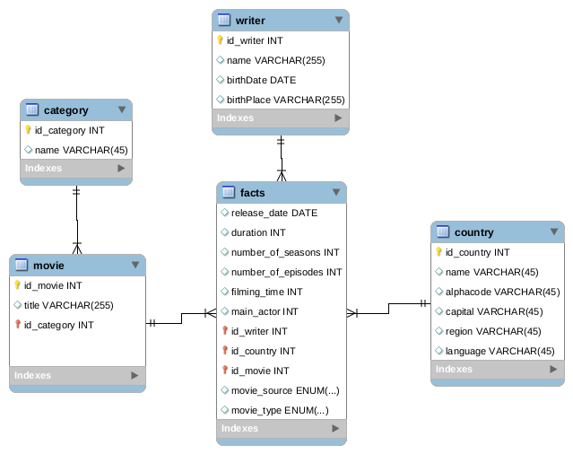

= Movie data warehouse

== Membre du groupe

. FALADE Irving
. DIALLO Ibrahima
. DIALLO Mamadou Saliou
. LE MEUR Gurvan

== Installation

Installer le gestionnaire de packet de python `pip3`
```
sudo apt install python3-pip

```

Installer les différentes librairies utilisées

```
pip3 install mysql-connector-python

pip3 install numpy

pip3 install pandas
```
== Schema en flocon de neige



== Configuration de la base de données MySQL
Ouvrir le fichier link:/src/config.py[config.py] et renseigner tout les champs.

CAUTION: Le champ `database` ne doit pas être modifié.


== Lancer le script

Maintenant on peut lancer le script pour créer la base de données, les différentes tables
et ajouter des données depuis les différentes sources de données.
Pour cela, on lance la commande suivante:

```
python3 src/main.py
```

== Les datasets utilisés.
Les principaux datasets utilisés issues de https://kaggle.com[Kaggle] utilise la
licence link:https://creativecommons.org/publicdomain/zero/1.0/[CC0: Public Domain]

- link:https://www.kaggle.com/unanimad/disney-plus-shows[Disney plus shows]
- link:https://www.kaggle.com/nilimajauhari/amazon-prime-tv-shows[Amazone Prime shows]
- link:https://www.kaggle.com/shivamb/netflix-shows[Netflix shows]
- link:https://restcountries.eu[API libre fournissant la liste des pays]

== Exemple de requête SPARQL

Pour les données indisponible dans certains datasets, des requêtes `SPARQL`
ont été utilisé sur link:https:dbpedia.org[dbpedia] via `AJAX` pour compléter les informations manquantes.

Voici quelques exemples:

.Information sur une série à partir de son titre
[source, sparql]
----
SELECT distinct 
        ?movie
        ?language
        ?releaseDate
        ?completionDate
        ?country
        ?numberOfEpisodes
        ?numberOfSeasons 
        (ceil(xsd:float(?completionDate-?releaseDate)/(24*60*60*365)) as ?shootingDuration) # en annee
        (count(?principalActors) as ?nbPrincipalActors)
        ?writer
        ?writerName
        ?writerBirthDate
        ?writerBirthPlace
        WHERE{
            ?movie rdf:type dbo:TelevisionShow;
                    dbp:name  "titre de la serie"@en;
                    dbp:country ?country;
                    dbo:numberOfEpisodes ?numberOfEpisodes;
                    dbo:numberOfSeasons ?numberOfSeasons;
                    dbp:starring ?principalActors;
                    dbp:creator ?writer;
                    dbp:language ?language
            OPTIONAL {
                    ?writer dbo:birthDate ?writerBirthDate;
                                    dbp:name ?writerName;
                                    dbp:birthPlace ?writerBirthPlace.
            }.
            OPTIONAL {?movie  dbo:completionDate ?completionDate;
                                dbo:releaseDate ?releaseDate}
        }
        LIMIT 1
----

.Information sur un film à partir de son titre
[source, sparql]
----
SELECT distinct 
        ?movie 
        ?language
        ?duration # en minutes
        ?benefice
        ?releaseDate
        (count(?acteurs)  as ?nbPrincipalActors)
        ?country
        ?writer
        ?writerName
        ?writerBirthDate
        ?writerBirthPlace
        WHERE{

        ?movie rdf:type dbo:Film;
                    dbp:name  "titre du film"@en;
                    dbo:runtime ?duration;
                    dbp:gross ?benefice;
                    dbo:starring  ?acteurs;
                    dbp:language ?language;
                    dbp:country ?country;
                    dbo:writer ?writer.
        OPTIONAL {
                            ?writer dbp:birthDate ?writerBirthDate;
                                        dbp:name  ?writerName;
                                        dbp:birthPlace ?writerBirthPlace}.
        OPTIONAL {?movie dbo:released ?releaseDate}.
        }
        LIMIT 1
----